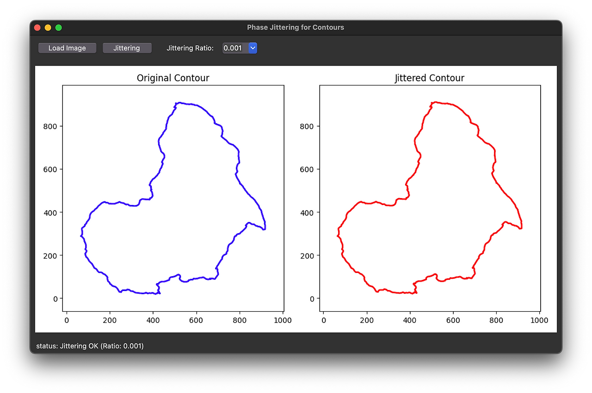

# PhaseJittering for Segmentation Contour

A GUI-based tool for applying phase jittering to image contours using Fourier transform. This tool is designed for data augmentation in computer vision tasks, particularly for segmentation mask contours.



## Overview

This application provides an interactive interface to load images, extract contours, and apply phase jittering transformations. Phase jittering is a technique that adds controlled randomness to contour shapes while preserving their overall structure, making it useful for data augmentation in machine learning applications.

## Features

- **Interactive GUI**: Easy-to-use tkinter-based interface
- **Image Loading**: Support for multiple image formats (PNG, JPG, JPEG, BMP, TIFF)
- **Automatic Contour Detection**: Extracts the largest contour from binary images
- **Phase Jittering**: Applies Fourier transform-based phase jittering
- **Adjustable Parameters**: Configurable jittering intensity
- **Real-time Visualization**: Side-by-side comparison of original and jittered contours

## Requirements

```
opencv-python
numpy
matplotlib
tkinter (usually included with Python)
```

## Installation

1. Clone this repository:
```bash
git clone https://github.com/bemoregt/PhaseJittering_for_SegmentationContour.git
cd PhaseJittering_for_SegmentationContour
```

2. Install required packages:
```bash
pip install opencv-python numpy matplotlib
```

## Usage

1. Run the application:
```bash
python phaseJitter_contour.py
```

2. Click "Load Image" to select an image file

3. Choose the jittering ratio from the dropdown menu (0.00001 to 0.1)

4. Click "Jittering" to apply phase jittering transformation

5. View the results in the side-by-side comparison

## How It Works

### Algorithm Steps:

1. **Image Preprocessing**: 
   - Convert image to grayscale
   - Apply binary thresholding
   - Extract contours using OpenCV

2. **Contour Conversion**:
   - Convert contour points to complex numbers (x + iy)
   - Prepare for Fourier analysis

3. **Phase Jittering**:
   - Apply Fast Fourier Transform (FFT) to contour
   - Generate random phase noise
   - Multiply Fourier coefficients by phase jittering factor
   - Apply Inverse FFT to reconstruct jittered contour

4. **Visualization**:
   - Display original and jittered contours
   - Maintain aspect ratio and scaling

### Mathematical Foundation:

The phase jittering is applied using:
```
fourier_jittered = fourier_desc * exp(i * 2π * random * jitter_amount)
```

Where:
- `fourier_desc`: FFT of the original contour
- `random`: Random values between 0 and 1
- `jitter_amount`: User-defined jittering intensity

## Parameters

- **Jittering Ratio**: Controls the intensity of phase jittering
  - Range: 0.00001 to 0.1
  - Lower values: Subtle changes
  - Higher values: More dramatic transformations

## Applications

- **Data Augmentation**: Generate variations of segmentation masks
- **Contour Analysis**: Study shape variations and robustness
- **Computer Vision Research**: Evaluate model performance under shape perturbations
- **Medical Imaging**: Augment organ boundary annotations
- **Object Detection**: Create diverse training samples from limited data

## File Structure

```
PhaseJittering_for_SegmentationContour/
├── phaseJitter_contour.py    # Main application file
├── phaseJitter.png          # Demo image
├── README.md               # This file
└── LICENSE                 # License information
```

## Technical Details

### Core Components:

- **ContourJitteringGUI**: Main application class
- **Image Processing**: OpenCV-based contour extraction
- **Fourier Analysis**: NumPy FFT implementation
- **Visualization**: Matplotlib integration with tkinter

### Key Methods:

- `load_image()`: Handles image loading and contour extraction
- `apply_jittering()`: Implements the core jittering algorithm
- `update_plot()`: Manages visualization updates

## Limitations

- Works with binary or easily thresholdable images
- Extracts only the largest contour
- GUI is single-threaded (may freeze during processing of large images)

## Contributing

Contributions are welcome! Please feel free to submit pull requests or open issues for bugs and feature requests.

## License

This project is licensed under the MIT License - see the [LICENSE](LICENSE) file for details.

## Citation

If you use this tool in your research, please consider citing:

```bibtex
@software{phase_jittering_contour,
  title={Phase Jittering for Segmentation Contour},
  author={bemoregt},
  url={https://github.com/bemoregt/PhaseJittering_for_SegmentationContour},
  year={2024}
}
```

## Contact

For questions or suggestions, please open an issue on GitHub.
